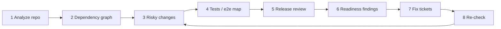
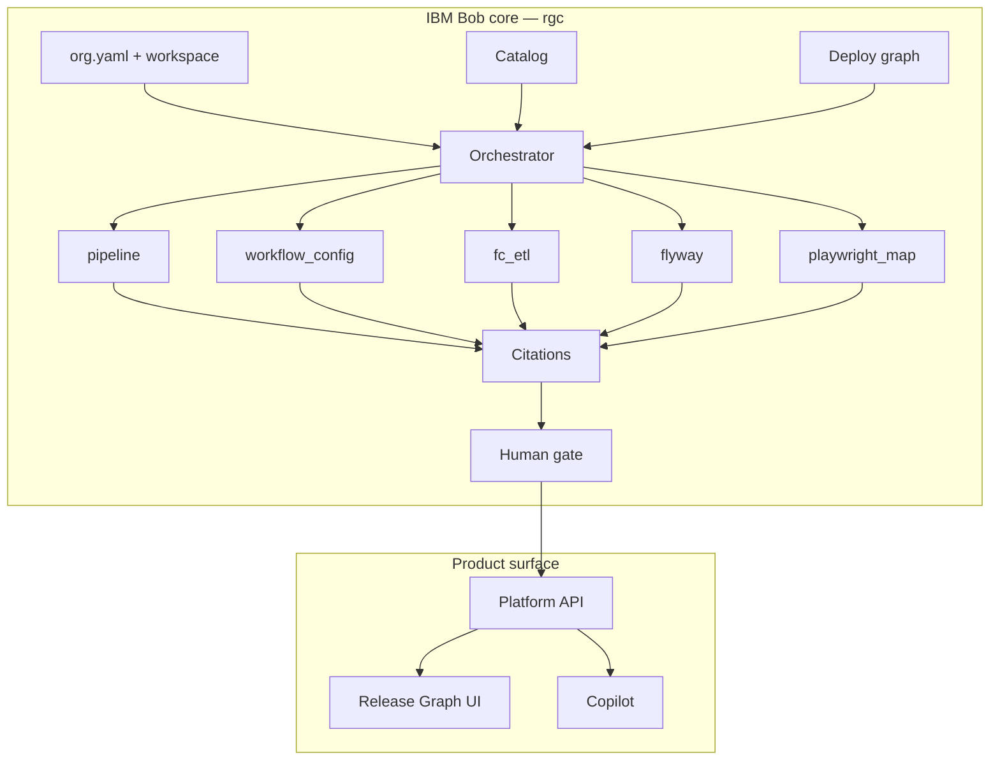

# ReleaseGraph Copilot

**Deploy-safety for engineering orgs — powered by an IBM Bob core.**

ReleaseGraph Copilot is a release-engineering platform. At its center is **`rgc`**, the deterministic deploy-safety engine **designed and built with IBM Bob**, IBM’s agentic coding system. Bob authored the models, graph algorithms, five concurrent checkers, citation engine, orchestrator, and human gate. The product UI and Copilot sit on that foundation. They do not replace it.

```
┌─────────────────────────────────────────────────────────────┐
│                     ReleaseGraph Copilot                    │
│  Dashboard · Release Graph · Readiness · Incidents · Chat   │
└────────────────────────────┬────────────────────────────────┘
                             │  tool-backed, evidence only
┌────────────────────────────▼────────────────────────────────┐
│              IBM Bob core  ·  rgc safety engine             │
│  Org YAML · Catalog · Graph · 5 checkers · Citations · Gate │
└─────────────────────────────────────────────────────────────┘
```

<p align="center">
  
  
  
  
  
</p>

---

## Watsonx Hackathon template

This repo follows the [IBM Hackathon GitHub project template](https://github.com/watsonxhackathon/ibm-hackathon-template): security ignore files, env placeholders, and a commit checklist so credentials are not committed or pasted into Bob.

| Template file | Role |
|---|---|
| [`.gitignore`](.gitignore) | Watsonx security patterns first; project paths below the marker |
| [`.bobignore`](.bobignore) | Stops Bob from logging credential-shaped text |
| [`.env.example`](.env.example) | Safe placeholders — copy to `.env`, never commit `.env` |
| [`SECURITY.MD`](SECURITY.MD) | Credential rules and AI-assistant hygiene |
| `bob_sessions/` | **Required for submission** — put exported Bob reports here (not live sessions) |

```bash
cp .env.example .env
# add keys locally only
git check-ignore -v .env
```

**Before every commit:** review `git diff`; no hardcoded keys; `.env` is not staged; no files named credential/secret/password; secrets only via environment variables. Details: [SECURITY.MD](SECURITY.MD).

---

## Problem & Solution Statement

Modern engineering orgs do not fail releases because they lack dashboards. They fail because **deploy safety is fragmented, late, and easy to talk around**. Pipeline status lives in one system. SQL migrations live in another. Feature-config and ETL contracts live in YAML that nobody diffs against the deploy graph. Playwright maps drift from the services that actually ship. When something breaks in production, the postmortem is a narrative: someone thought CI was green, someone thought the migration was additive, someone thought checkout was covered by e2e.

Large language models make that worse if they are allowed to *discover* risk. An assistant that invents a file path, a missing test, or a blast-radius victim is not a safety tool. It is a second source of fiction. Release managers need a **verdict they can defend in a change-advisory meeting**: go or no-go, with citations, with a human still holding the gate.

**ReleaseGraph Copilot** solves that by splitting the problem in two.

The **problem we refuse to give to a chatbot** is the verdict. The IBM Bob–built engine (`rgc`) reads an org the way a staff engineer would: `org.yaml`, a repo catalog, a deploy graph, CI status JSON, workspace overlays, and a release manifest. Five checkers run concurrently and in isolation—pipeline, workflow config, feature-config/ETL, Flyway SQL, Playwright map. Graph code uses Kahn topological sort and cycle detection so a cyclic deploy graph is a hard failure, not a pretty picture. Findings are frozen types (`Finding`, `CheckResult`, `Checklist`). Citations attach runbook sections. The human gate writes `checklist.json` and `gate.json` (`blocked` or `pending_approval`) and will not emit an e2e trigger until a person approves.

The **problem we do give to a product layer** is comprehension. FastAPI and the React console turn the same engine output into a release graph, readiness scan, incidents, and a Copilot that may only rephrase **tool results**. No login and no database are required to try it: the demo boots in memory so evaluators can see the gate, not provision Postgres.

The solution is therefore not “AI for DevOps.” It is **deterministic org-scale deploy checks, designed with IBM Bob, with a human gate that cannot be skipped, plus a UI that never invents a finding the checkers did not produce.** That is the only way a release system stays honest when the blast radius is an entire checkout or streaming path.

*(Word count: 390)*

---

## IBM Bob Usage Statement

IBM Bob was not used as a chat window for snippets. It was used as **the primary implementation agent for the deploy-safety core**, working from an IBM Bob 2.0 execution plan and a sequence of scoped tasks (org scan, generic org config, checker suite, gate, CLI).

Bob built the `rgc` package layer by layer. It scaffolded packaging (`pyproject.toml`, Python 3.11+). It wrote frozen models (`Citation`, `Finding`, `CheckResult`, `E2EScope`, `Checklist`). It implemented the deploy graph (Kahn sort, DFS cycle detection, blast-radius closure) and a catalog loader sized for large fixture registries. It wrote manifest validation (invalid release JSON fails closed), an overlay-aware workspace reader, and five concurrent checkers: pipeline, workflow config, FC/ETL, Flyway, and Playwright map. It built citations (runbook search and blocker reports) and an orchestrator that fans checkers out on a thread pool with per-checker timeouts and exception isolation so one hung check cannot stall the release.

Bob implemented the **human gate** (`rgc/gate.py`): `check`, `approve`, and `cancel`, including checklist/gate JSON and e2e-trigger lifecycle. It wrote the CLI (`check`, `approve`, `cancel`) and a local HTML server so an org can be scanned without the SaaS UI. It generated fixtures (release scenarios, deploy graphs, catalog, workspace files) and the test suite that covers unit, integration, scenario, and org-scan paths.

When the plan evolved from company-specific checkers to a **generic org schema**, Bob redesigned `OrgConfig` (protected paths, max deploy repos, optional citations), replaced E2E-only scope with `DeployScope`, added generic checkers (`ci_status`, `db_migration`, `config_change`, `secret_scan`, `changeset_size`) where the plan required them, and renamed fixture workspaces to generic service names. Session logs show Bob running pytest after each layer, then repairing workflow-config overlay deduplication and Flyway comment stripping when tests failed—not by weakening assertions, but by fixing the engine.

Humans directed scope, reviewed diffs, and built the ReleaseGraph product surface (`releasegraph/`, `web/`) **on top of** Bob’s engine. Copilot wording and Railway packaging are product concerns. **Go / no-go remains Bob’s code.** Evidence of those task sessions is stored, unchanged in folder name, under [`IBM Bob Task Session Summary Screenshots`](IBM%20Bob%20Task%20Session%20Summary%20Screenshots/).

*(Word count: 335)*

---

## Is the hackathon workflow depicted? Yes.

Judges asked for: **developer workflow → real/sample project → multiple steps → agentic workflow → measurable reduction in effort/errors/time.**

That is the product loop. IBM Bob built the **agent capabilities**. ReleaseGraph Copilot is the **experience** that runs those capabilities on a sample org (`demo/ecommerce`, `demo/streaming`, `fixtures/`) in eight steps. You do not re-prompt Bob for each release. You open the app (or `python -m rgc check`) and the same engine runs again.



| # | Bob capability (engine) | What you click in the product | Measurable outcome |
|---|---|---|---|
| 1 | Analyze an unfamiliar repository | **Readiness** → scan workspace / `rgc check --workspace` | Services and files discovered without a human walking the tree |
| 2 | Generate release / dependency understanding | **Release Graph** (`rgc/graph.py` + UI) | Nodes, edges, blast radius, cyclic-graph fail |
| 3 | Identify risky changes | Risk scores, Flyway/FC-ETL/pipeline findings | High-severity issues counted on Home |
| 4 | Create / update tests | Bob authored `tests/` + **playwright_map** checker | Missing or drifted e2e map is a blocker, not a guess |
| 5 | Code / release review | **Releases**, deploy gate, Copilot (tools only) | Deploy blocked while critical findings remain |
| 6 | Release-readiness findings | **Readiness** GO/NO-GO + `checklist.json` | Verdict + citations, not a chat paragraph |
| 7 | Help implement fixes | **Fix PRs** (file, line, engine fix) + Copilot | Assigned tickets; human must approve |
| 8 | Re-check after changes | **Re-scan workspace** on Fix PRs / Incidents | Ticket closes only if the finding is gone |

**Effort / errors / time:** one scan replaces ad-hoc grepping of pipelines, SQL, and e2e folders. The gate cannot be skipped. Re-scan prevents “we think we fixed it.” Copilot cannot invent a path the checkers did not emit.

Honest limit: the UI does not have Bob sit in the editor and write a patch for you. Step 7 is **engine-suggested fixes + human apply on disk + step 8**. That is the intended safety model.

---

## IBM Bob Task Session Summary Screenshots

Session captures from IBM Bob while it implemented the `rgc` core. Folder name is kept as specified: **`IBM Bob Task Session Summary Screenshots`**.

| Session | What Bob was doing |
|---|---|
| Build complete — `rgc` layers | Models, graph, catalog, manifest, workspace, checkers, citations, orchestrator, gate, CLI, server, fixtures, tests |
| Checker repairs | Workflow-config overlay dedupe; Flyway `DELETE`/`WHERE` and comment stripping |
| Execution-plan build | Step-by-step from `IBM_BOB_2.0_EXECUTION_PLAN.md` (package → models → graph) |
| Org-config redesign | Generic schema; new checkers; file-level task status |
| Org scan accomplished | Generic workspaces, `DeployScope`, CI/migration/secret/changeset checkers |
| Gate + CLI | `gate.py` check / approve / cancel and release CLI wiring |

<p align="center">
  
</p>
<p align="center">
  
</p>
<p align="center">
  
</p>
<p align="center">
  
</p>
<p align="center">
  
</p>
<p align="center">
  
</p>

---

## Why IBM Bob is the core

Bob did not “help write a few files.” The **`rgc/` package is the product’s source of truth for go / no-go**. Every Readiness scan, deploy gate, and Copilot answer that talks about pipelines, migrations, or blast radius bottoms out in this engine.

| Bob-built layer | Path | What it does |
|---|---|---|
| **Models** | `rgc/models.py` | Frozen types: `Finding`, `CheckResult`, `E2EScope`, `Checklist` |
| **Graph** | `rgc/graph.py` | Kahn topological sort, DFS cycle detection, blast-radius closure |
| **Catalog** | `rgc/catalog.py` | Repo registry (1,000+ fixture entries for scale tests) |
| **Manifest** | `rgc/manifest.py` | Release JSON + six-level validation |
| **Workspace** | `rgc/workspace.py` | Overlay-aware file view of the org |
| **Checkers** | `rgc/checkers/` | Five concurrent, isolated safety checks |
| **Citations** | `rgc/citations.py` | Runbook section search + blocker report |
| **Orchestrator** | `rgc/orchestrator.py` | Thread-pool fan-out, per-checker timeout, exception isolation |
| **Human gate** | `rgc/gate.py` | `check` · `approve` · `cancel` — no silent ship |
| **CLI + local UI** | `rgc/cli.py`, `rgc/server.py` | Org scan from the terminal or a local HTML console |

The React app and FastAPI platform (`releasegraph/`, `web/`) **consume** this engine. They add graphs, incidents, and a tool-backed Copilot. They never invent a finding the checkers did not produce.



---

## The five checkers

Checkers run **in parallel**, each isolated. A failure in one does not take down the others. Order is stable so reports are comparable across releases.

| # | Checker | Blocks when |
|---|---|---|
| 1 | **pipeline** | Required CI is missing, red, or not mapped to the repo |
| 2 | **workflow_config** | Overlay / workflow YAML is invalid or conflicts on the same path |
| 3 | **fc_etl** | Feature-config / ETL contract breaks the deploy path |
| 4 | **flyway** | Unsafe SQL (`DELETE`/`UPDATE` without `WHERE`, destructive DDL) |
| 5 | **playwright_map** | E2E map and deploy graph disagree on what must be tested |

Verdicts are **`go` / `no_go`**. `no_go` writes `gate.json` as `blocked`. Anything else waits for a human: `pending_approval` until `rgc approve`.

```bash
python -m rgc check --release fixtures/releases/safe.json --out out/safe
python -m rgc approve --out out/safe
python -m rgc cancel  --out out/safe
```

---

## Org scan

Point Bob’s engine at any org folder. No platform server required.

```bash
python3 -m rgc check \
  --workspace /path/to/org \
  --config /path/to/org.yaml \
  --repos gateway,api \
  --ci-dir /path/to/ci-status \
  --out out/scan
```

Org YAML, catalog, CI status JSON, and the deploy graph live under [`fixtures/`](fixtures/). See [`fixtures/org.yaml`](fixtures/org.yaml).

Local console (HTML, no build step):

```bash
python -m rgc serve --host 127.0.0.1 --port 8765
```

---

## Product layer on top of Bob

| Surface | Role |
|---|---|
| **Platform API** `releasegraph/` | FastAPI — releases, graph, readiness, incidents, audit, Copilot tools |
| **Web UI** `web/` | React — dashboard, Release Graph (React Flow), Fix PRs, Copilot |
| **SDK** `releasegraph.sdk` | Scan a microservices folder from Python; no login |
| **Demo stacks** `demo/` | E-commerce + streaming services for blast-radius and failure demos |

Copilot answers **only from engine tools**. Groq is optional wording. With no `GROQ_API_KEY`, Copilot still answers from checker and graph data.

Demo mode needs **no login and no database**. Data is seeded in process memory on boot.

---

## Quick start

```bash
python3 -m venv .venv
.venv/bin/pip install -e ".[dev]"
.venv/bin/python -m releasegraph.cli serve_api
```

Open [http://127.0.0.1:8000](http://127.0.0.1:8000) (build the UI once with `cd web && npm install && npm run build`).

Frontend hot-reload:

```bash
cd web && npm install && npm run dev
# http://localhost:5173
```

Full demo shop + platform:

```bash
./scripts/dev-all.sh
```

---

## SDK

```python
from releasegraph.sdk import analyze_workspace

result = analyze_workspace("/path/to/microservices")
print(result["summary"])
for link in result["broken_links"]:
    print(link["from"], "→", link["to"], link["if_breaks"])
```

```bash
.venv/bin/releasegraph-scan /path/to/microservices
.venv/bin/releasegraph-scan /path/to/microservices --json
```

---

## Deploy (Railway)

One container. No Postgres plugin. No `DATABASE_URL`. No login.

```bash
railway login
railway init
railway up
```

| Variable | Default | Notes |
|---|---|---|
| `PORT` | set by Railway | Do not override |
| `CORS_ORIGINS` | `*` | Same-origin UI works without this |
| `RG_AI_DISABLE` | `false` | Copilot on; demo answers if no Groq key |
| `GROQ_API_KEY` | unset | Optional live Groq rephrasing |
| `DATABASE_URL` | **ignored** | Do not add a database plugin |

Health: `/health` (`storage: memory`, `groq: true`). Docs: `/api/docs`.

Artifacts: [`railway.json`](railway.json) · [`Dockerfile`](Dockerfile) · [`Procfile`](Procfile)

---

## Tests

```bash
.venv/bin/python -m pytest -q
```

The Bob core is covered by unit, integration, scenario, and org-scan tests under [`tests/`](tests/) against [`fixtures/`](fixtures/).

---

## Repository map

```
rgc/                                              IBM Bob core — checkers, graph, gate, CLI
releasegraph/                                     Platform API + Copilot tools (calls rgc)
web/                                              React console
demo/                                             Ecommerce + streaming sandboxes
fixtures/                                         Org YAML, graphs, CI status, release manifests
docs/                                             Architecture and demo scenarios
IBM Bob Task Session Summary Screenshots/         Bob task-session photos (name kept)
```

---

## Documentation

- [Architecture](docs/architecture.md)
- [Demo scenarios](docs/demo-scenarios.md)
- [E-commerce demo](demo/ecommerce/README.md)

---

## Credit

The **`rgc` safety engine** — types, deploy graph, catalog, manifest validation, workspace overlays, five concurrent checkers, citations, orchestrator, and human gate — was built with **IBM Bob 2.0**. ReleaseGraph Copilot is the product surface on that core.
